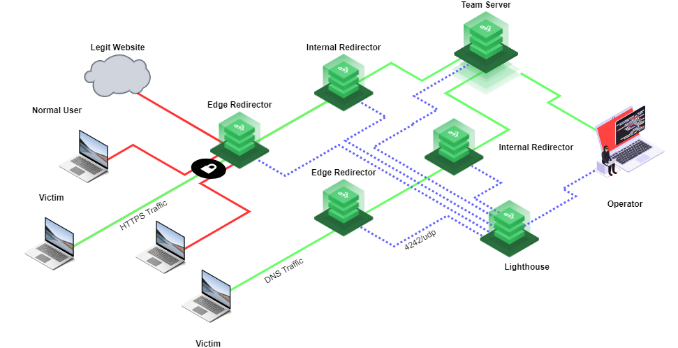

Setup:

mkdir -p src/{config,templates}
mkdir -p src/templates/{certificates,configs,files,keys}
mkdir -p src/templates/configs/{nebula,web}

touch {providers,edge-redirectors,internal-redirectors,variables,output,team-server,lighthouse,security,dns}.tf

The six (6) virtual machines used in this build are stored in four (4) files:

- lighthouse.tf
- team-server.tf
- edge-redirectors.tf
- winternal-redirectors.tf

SSWH_KEY -> tls_private_key

Linode Cloud Manager

terraform init
terraform plan
terraform apply

Continue from DNS Setup section"
https://blog.malicious.group/automating-c2-infrastructure-with-terraform-nebula-caddy-and-cobalt-strike/

Nebula Network

- setup a new CA certificate, (setup.tf)

Nebula configuration file -> for each configuration:

- config-lighthouse.yaml
- config-teamserver.yaml
- config-edge.yaml
- config-internal.yaml
- config-operator.yaml