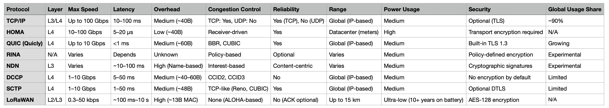
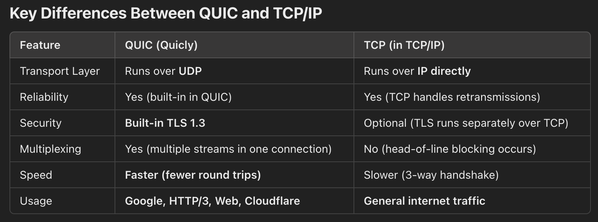

## 1. Coordination Backend

Should it be separate microservice?
`
brew install redis

`
redis-server
`

`
redis-cli
`

`
KEYS *
`
`

`
GET cyb1_response
`

`
openai migrate
`

`
uvicorn main:app --reload
`

## 1. Network Protocols

# NS-3 & NetAnim
https://www.projectguideline.com/visualizing-ns-3-simulation-using-netanim/

**Simulate point-to point in TCP/IP**

- MaxPackets (1)
- Interval (1.0)
- PacketSize (1024)
___

- At time +2s client sent 1024 bytes to 10.1.2.4 port 9
- At time +2.00926s server received 1024 bytes from 10.1.3.3 port 49153
- At time +2.00926s server sent 1024 bytes to 10.1.3.3 port 49153
- At time +2.02449s client received 1024 bytes from 10.1.2.4 port 9

____

https://signetlabdei.github.io/lorawan/models/build/html/lorawan.html#lorawan-topology

> IEEE 802.15.4 (LR-WPAN) -> 6LoWPAN
> 
> Cellular IoT (Long-Range) (NB-IoT, Cat-M1, etc.).
> 
> WIFI (802.11) -> 802.11ah (Sub-1 GHz)
> 
 

# Lorawan
> LoRaWAN (Long-Range, Low Power)

https://www.projectguideline.com/installing-lorawan-extension-module-version-v0-3-1-under-ns-3-42/

- End Devices (EDs), 
- Gateways (GWs) 
- Network Server (NS).

PHY Layer -> The PHY (Physical) Layer is the lowest layer in the network protocol stack and is responsible for the actual transmission and reception of data over a physical medium.

1. Initializing the Network
2. Creating the End Device (LoRaWAN Node)
3. Creating the Gateway
4. Preparing the Transmission

- OneShotSender:OneShotSender()
- EndDeviceLorawanMac:SetDataRate(..., 5)
- EndDeviceLorawanMac:GetChannelForTx(): Chooses a transmission frequency (e.g., 868.3 MHz`)

5. Packet Transmission

- LoraFrameHeader:Serialize()
- LorawanMacHeader:Serialize()
- ClassAEndDeviceLorawanMac:SendToPhy()
- LoraPhy:GetOnAirTime(...)

./ns3 run third

WiFi

-> Access Point
-> Station

_____

**RINA** (Recursive InterNetwork Architecture)

-> not need TLS
-> more than 1000 times faster than TCP/IP 
-> not need TLS

Data-Link Layer (DLC): Responsible for node-to-node communication, error correction, and addressing within a single network segment.
Network Layer (NL): Handles addressing and routing between different network segments.
Transport Layer (TL): Manages end-to-end communication, flow control, and reliability.
Application Layer: Implements higher-level protocols.

While you can't run Linux-specific modules on macOS, you can still develop and experiment with networking protocols
and simulations in macOS if they don’t require kernel-level interaction. 

https://irati.github.io/stack/
https://github.com/IRATI/stack/wiki/Software-architecture-overview
https://github.com/IRATI/stack/wiki/Tutorials
https://pouzinsociety.org/iot-or-coping-with-the-tribble-syndrome/

TCP/IP and RINA:
Protocols: Internet – 15; RINA – 3
Non-security mechanisms: Internet – 89; RINA – 15
Security mechanisms: Internet – 28; RINA – 7

https://www.martingeddes.com/think-tank/network-architecture-research-tcp-ip-vs-rina/

https://www.nsnam.com/2024/08/ns3-installation-in-mac-m1.html

`
brew install cmake ninja gnuplot cache 

brew install wget
wget https://www.nsnam.org/releases/ns-allinone-3.42.tar.bz2

tar jxvf ns-allinone-3.42.tar.bz2
cd ns-allinone-3.42/
./build.py --enable-examples --enable-tests
`

RINASim

Application Layer (top-most layer for handling user data)
Transport Layer (for data transfer)
Link Layer (handling actual physical transmission)

Recursion instead fixed layers. 

- IRATI (for real-world testing)
- RINASim in OMNeT++ (for simulations)

_____

**NDN** (Named Data Networking)

IoT, content heavy

Not Ip Addresses. 

1. Simulation Approach 
   a. NetworkX
   b. Mininet 
   c. NS-3
   d OMNeT++

### TCP Alternatives:

- **HOMA/QUIC** ([Quicly](https://github.com/h2o/quicly/))
-   (ok) Future internet architectures (RINA)
-   (ok) Future decentralized networking (NDN)
- **DCCP** (Datagram Congestion Control Protocol) - Video Streaming, Gaming
- **SCTP** (Stream Control Transmission Protocol) - 5G

---